# Implantação de um Agente de Due Diligence com Antigravity CLI e ADK: Laboratório com Desafio

## Informações do Laboratório

- **Tempo estimado:** 1 hora 30 minutos
- **Nível:** `Foundational` / `Intermediate`

---

## Visão Geral

Neste laboratório prático com desafio, você vai demonstrar sua capacidade de usar o **Antigravity CLI (`agy`)** como copiloto de desenvolvimento em terminal para construir um agente inteligente com o **Kit de Desenvolvimento de Agente (ADK)** aproveitando o ecossistema de **Skills** do `agents-cli`.

Você vai integrar uma skill especializada de Due Diligence, testar e refinar o comportamento localmente com a interface **ADK Web**, orquestrar a implantação no **Google Cloud Agent Runtime** diretamente através do assistente `agy` e publicá-lo no **Gemini Enterprise App**.

### Objetivos do Laboratório

Neste laboratório, você aprende a realizar as seguintes tarefas:

- Configurar o ambiente do Cloud Shell e inicializar o assistente **Antigravity CLI (`agy`)**.
- Instalar o `agents-cli` e habilitar a suíte de skills do ADK para uso no `agy`.
- Criar e estruturar um agente ADK de Due Diligence integrado a skills usando o comando interativo `/grill-me` no `agy`.
- Executar, validar e depurar o fluxo do agente localmente com a interface **ADK Web** com assistência do `agy`.
- Fazer a implantação do agente no **Google Cloud Agent Runtime** utilizando o `agy` e as skills do `agents-cli`.
- Publicar e disponibilizar o agente no **Gemini Enterprise App** conectando o resource name do Agent Runtime.

---

## Configuração e Requisitos

### Antes de clicar no botão Iniciar laboratório

Leia atentamente estas instruções. Os laboratórios são cronometrados e não podem ser pausados. O temporizador é iniciado assim que você clica em **Iniciar laboratório** e indica por quanto tempo os recursos do Google Cloud permanecerão disponíveis para você.

Este laboratório prático permite realizar as atividades em um ambiente real de nuvem, e não em uma simulação ou demonstração. Você receberá novas credenciais temporárias para fazer login e acessar o Google Cloud durante a sessão.

Para concluir este laboratório, você precisa de:

- Acesso a um navegador de internet padrão (recomendamos o Google Chrome).
- Tempo suficiente para concluir o roteiro — lembre-se de que não é possível pausar um laboratório em andamento.

> ⚠️ **MUITO IMPORTANTE — Janela Anônima Obrigatória:**  
> Utilize sempre uma **Janela Anônima (Incognito)** ou privada do navegador Google Chrome para executar este laboratório. Isso evita conflitos de autenticação entre sua conta pessoal/corporativa e a conta de estudante temporária, prevenindo cobranças indevidas em sua conta pessoal.

> 🔒 **Uso Exclusivo da Conta de Estudante:**  
> Utilize estritamente as credenciais fornecidas no painel do laboratório. Se você utilizar sua conta pessoal do Google Cloud, cobranças poderão ser geradas diretamente nela.

### Fazer login no Console do Google Cloud

1. No painel lateral esquerdo do laboratório, clique com o botão direito no botão **Abrir console do Google Cloud** e selecione **Abrir link em janela anônima**.
2. Na tela de login do Google, cole o **Nome de usuário** temporário fornecido pelo painel e clique em **Avançar**.
3. Cole a **Senha** temporária fornecida e clique em **Avançar**.
4. Conclua as telas seguintes aceitando os termos e **NÃO** adicionando telefone de recuperação ou 2FA nesta conta temporária.

---

## Cenário do Desafio

A **Cymbal Technologies** é uma empresa líder em soluções corporativas de tecnologia em nuvem e inteligência artificial sediada no Vale do Silício, em franca expansão global. Com uma estratégia agressiva de fusões, aquisições (M&A) e contratação massiva de fornecedores de tecnologia, os times jurídico e de compliance da Cymbal Technologies estão sobrecarregados com o volume de contratos sociais, termos de confidencialidade e instrumentos societários que precisam ser auditados minuciosamente todos os dias.

Para dar escala a essas auditorias mantendo o mais rigoroso padrão de compliance, a liderança de engenharia designou você como Engenheiro de IA da **Cymbal Technologies**. 

**O seu desafio é criar um agente de Due Diligence usando `agents-cli` e ADK para servir no Gemini Enterprise App da Cymbal Technologies através do Agent Runtime.**

Você será responsável por configurar o assistente **Antigravity CLI (`agy`)**, explorar as skills fornecidas pelo `agents-cli`, utilizar técnicas de prompting e refinamento com o comando `/grill-me` para incorporar a skill de auditoria contratual, testar e depurar a solução localmente, orquestrar o deployment no **Agent Runtime** utilizando as skills do `agy` e disponibilizar o agente diretamente no **Gemini Enterprise** para os colaboradores da Cymbal Technologies.

---

## Tarefa 1. Configurar o ambiente e inicializar o Antigravity CLI

Nesta tarefa, você inicializa as variáveis do Cloud Shell, clona os artefatos do workshop, instala as ferramentas CLI (`uv` e `agy`) e autentica o assistente de desenvolvimento no seu projeto Google Cloud.

1. No Console do Google Cloud, clique em **Ativar o Cloud Shell** (ícone `>_`).
2. Quando for exibida a janela pop-up solicitando **"Autorizar o Cloud Shell a fazer chamadas de API do GCP"**, clique obrigatoriamente em **Autorizar** (*Authorize*).
3. Inicialize as variáveis de ambiente com o projeto sandbox ativo:

```bash
export PROJECT_ID=$DEVSHELL_PROJECT_ID

# Obter dinamicamente a região e zona atribuídas ao sandbox pelo Qwiklabs:
export REGION=$(gcloud compute project-info describe --format="value(commonInstanceMetadata[google-compute-default-region])" 2>/dev/null)
export REGION=${REGION:-$(gcloud config get-value compute/region 2>/dev/null)}
export REGION=${REGION:-us-central1}

export ZONE=$(gcloud compute project-info describe --format="value(commonInstanceMetadata[google-compute-default-zone])" 2>/dev/null)
export ZONE=${ZONE:-${REGION}-a}

gcloud config set project $PROJECT_ID
gcloud config set compute/region $REGION
gcloud config set compute/zone $ZONE
```

4. Clone o repositório do workshop:

```bash
git clone https://github.com/carlosmscabral/workshop-agy.git ~/workshop-agy
cd ~/workshop-agy
```

5. Instale o gerenciador de pacotes `uv` e a CLI do Antigravity (`agy`):

```bash
curl -LsSf https://astral.sh/uv/install.sh | sh
source $HOME/.local/bin/env

curl -fsSL https://antigravity.google/cli/install.sh | bash
export PATH="$HOME/.local/bin:$PATH"
```

6. Inicie o setup interativo do **Antigravity CLI**:

```bash
agy
```

7. Siga as 9 etapas de autenticação, configuração e inicialização exibidas no terminal:
- **Passo 1:** Selecione `2. Use a Google Cloud project`  
  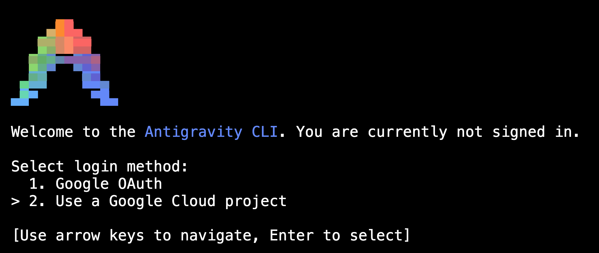
- **Passo 2:** Selecione `1. Continue with Google Cloud`  
  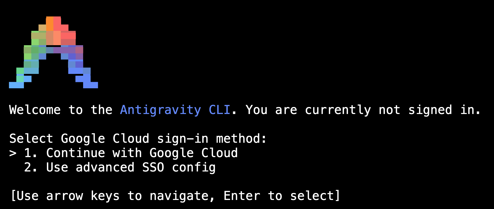
- **Passo 3:** Conceda as permissões de acesso na Janela Anônima  
  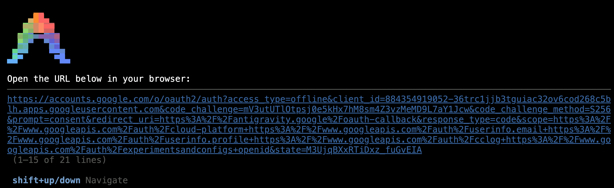
- **Passo 4:** Cole o ID do seu projeto sandbox (`echo $PROJECT_ID`)  
  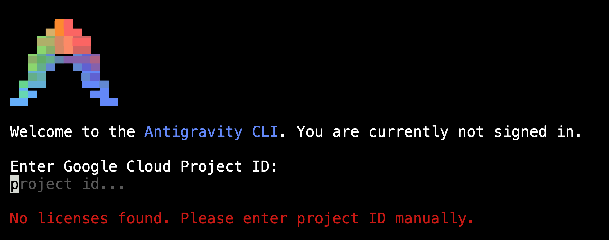
- **Passo 5:** Em **Select Google Cloud Location**, selecione a opção `global`  
  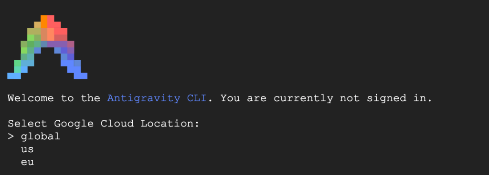
- **Passo 6:** Em **Select License**, selecione a opção `1. Agent Platform`  
  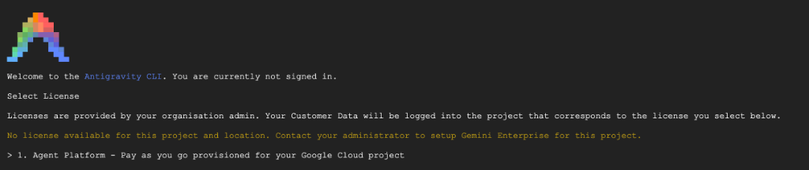
- **Passo 7:** Em **Choose your color scheme**, selecione o tema de cores de preferência (ex: `dark`)  
  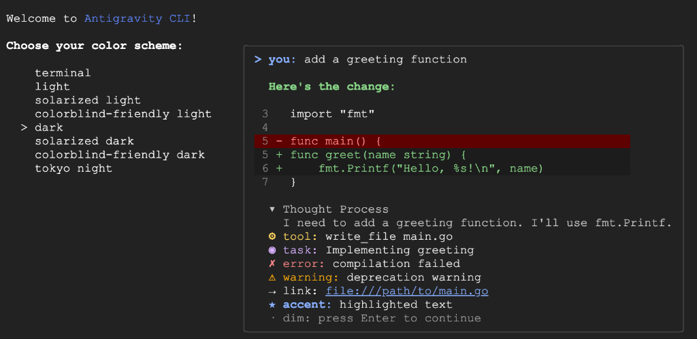
- **Passo 8:** Em **Terms of Service & Data Use**, selecione `Done` para aceitar os termos  
  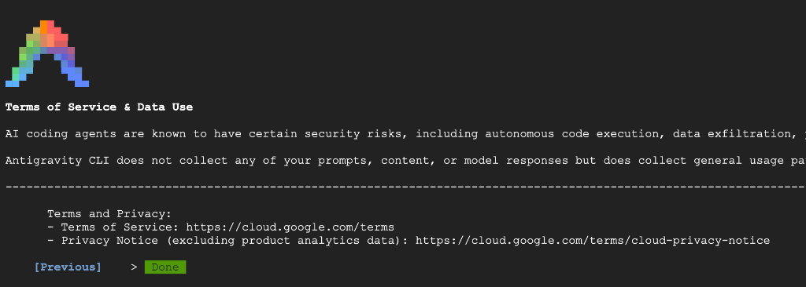
- **Passo 9:** Em **Do you trust the contents of this project?**, selecione `Yes, I trust this folder`  
  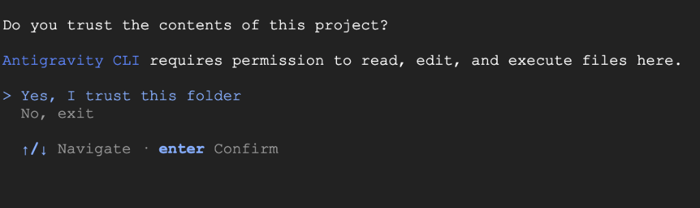

---

## Tarefa 2. Instalar o agents-cli, habilitar skills e criar o agente

Nesta tarefa, você instala o `agents-cli`, habilita o catálogo de skills do ADK no assistente `agy`, configura as variáveis de ambiente do projeto e utiliza o comando `/grill-me` para alinhar e gerar a arquitetura do agente de Due Diligence.

> 💡 **Atenção:** Ao concluir o setup na Tarefa 1, o `agy` permanece ativo no terminal. Digite `/exit` e pressione `ENTER` para retornar ao terminal bash antes de executar os comandos a seguir.

1. Instale e configure o `agents-cli`:

```bash
uvx google-agents-cli setup
export PATH=$PATH:"$HOME/.local/bin"
```
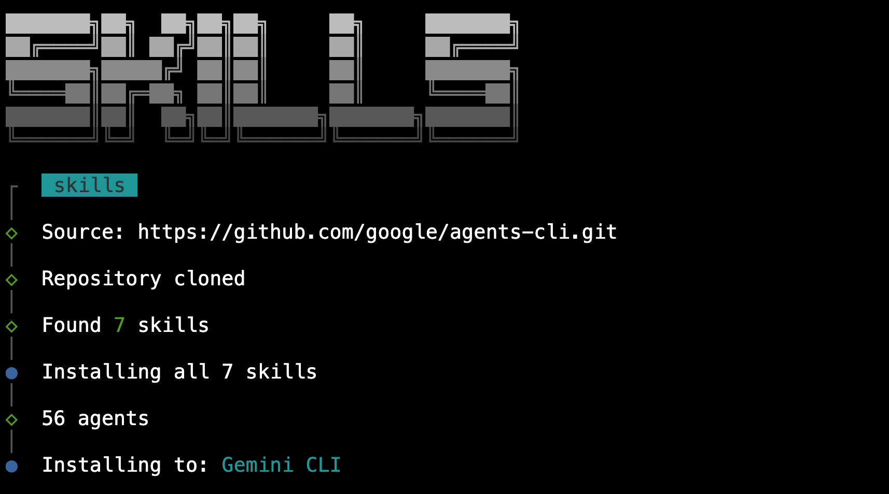

2. Inicie o `agy` e verifique as skills disponíveis digitando `/skills`:

```bash
agy
```
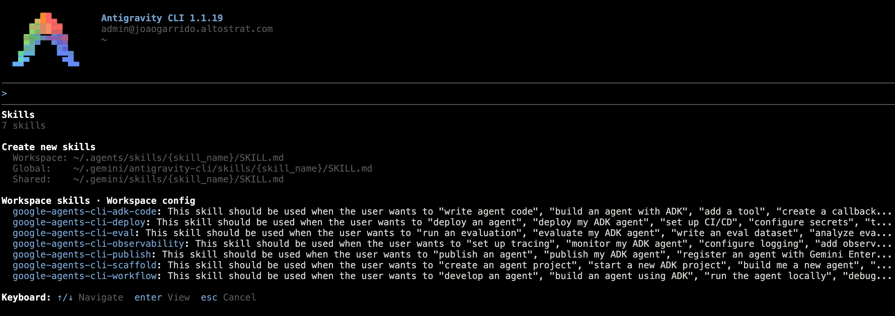

3. Crie o arquivo de variáveis de ambiente `.env`:

```bash
cat << EOF > .env
GOOGLE_GENAI_USE_VERTEXAI=TRUE
GOOGLE_CLOUD_PROJECT=${PROJECT_ID}
GOOGLE_CLOUD_LOCATION=${REGION}
MODEL=gemini-2.5-flash
EOF
```

4. No prompt do `agy`, execute o comando `/grill-me` para alinhamento interativo:
   - Responda às perguntas com foco na auditoria societária (veja tabela de suporte no arquivo `lab_instructions.md`).

5. Solicite ao `agy` para criar a estrutura do agente:
   > *"Crie um projeto de agente ADK chamado `due-diligence-agent` utilizando as skills do `agents-cli` e integre os protocolos e regras da skill em `skills/due-diligence-contract`."*

6. Sincronize as dependências do agente gerado:

```bash
cd ~/workshop-agy
uv sync
```

---

## Tarefa 3. Testar e refinar o agente localmente com ADK Web

Nesta tarefa, você valida o comportamento do agente e suas regras de gating através da interface visual do ADK Web, utilizando o `agy` para depurar e refinar qualquer resposta conforme necessário.

1. Inicie a interface Web do ADK:

```bash
uv run adk web
```

2. No Cloud Shell, clique em **Visualização na Web** (*Web Preview*) e selecione a porta **8000**.
3. Teste a regra de gating e a auditoria de contrato enviando o arquivo `docs/sample_contract.pdf`.
4. Refine prompts com o `agy` caso deseje ajustar o relatório.
5. Quando concluir a validação, pressione `CTRL+C` no terminal para encerrar o servidor do ADK Web.

---

## Tarefa 4. Fazer o deploy do agente no Google Cloud Agent Runtime

Nesta tarefa, você utiliza o assistente Antigravity CLI para orquestrar a compilação, containerização e implantação do agente no **Google Cloud Agent Runtime** através das skills integradas do `agents-cli`.

1. Inicie o `agy` e solicite a implantação:
   > *"Faça o deploy do agente `due-diligence-agent` no Agent Runtime no projeto $PROJECT_ID na região $REGION."*

2. Aguarde a finalização (3 a 7 minutos) e anote o **Resource Name** gerado (`projects/.../locations/.../agents/...`).
3. Valide a prontidão do agente remoto executando uma consulta de teste no `agy` e saia com `/exit`.

---

## Tarefa 5. Conectar e publicar o agente no Gemini Enterprise App

Nesta tarefa final, você conecta o recurso do Agent Runtime ao **Gemini Enterprise App** para disponibilizar o assistente de Due Diligence para os colaboradores corporativos da Cymbal Technologies.

1. No Console do Google Cloud, pesquise por **Gemini Enterprise** ou **Agent Builder**.
2. Habilite o Gemini Enterprise App:  
   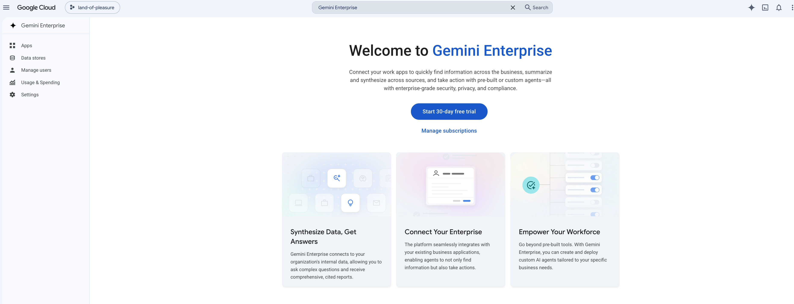
3. Crie um aplicativo corporativo chamado **Cymbal Compliance & Legal Hub**:  
   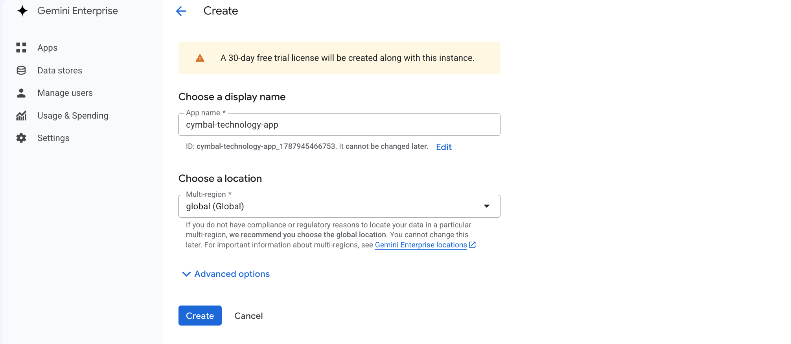
4. Na aba **Features**, ative a opção **Agentes** (*Agents*).
5. No menu **Agentes**, clique em **Adicionar Agente** (*Add Agent*):  
   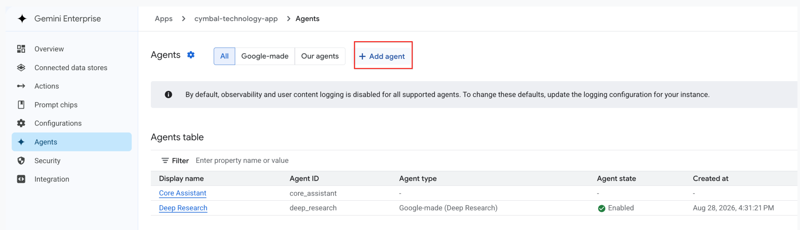
6. Selecione **Agentes do Agent Runtime** e cole o **Resource Name** obtido na Tarefa 4:  
   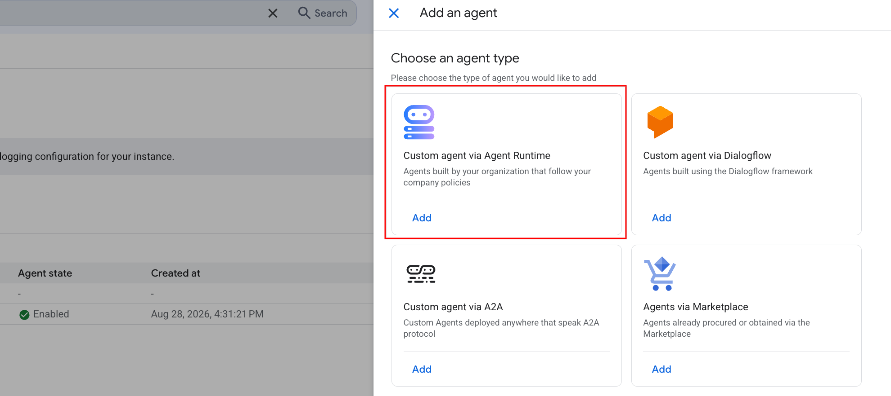
7. Inicie uma conversa de teste no Gemini Enterprise enviando trechos do contrato para validar a geração do relatório em ambiente corporativo.

---

## Encerrar o Laboratório

1. Ao concluir todas as atividades, clique no botão vermelho **Terminar o laboratório** (*End Lab*).
2. Na janela de confirmação, clique em **Enviar** (*Submit*).
3. Avalie sua experiência com o laboratório selecionando de 1 a 5 estrelas.

---

## Parabéns!

Você concluiu com sucesso o laboratório com desafio de **Implantação de Agente de Due Diligence com Antigravity CLI e ADK**!

**Manual Last Updated: September 1, 2026**  
**Lab Last Tested: September 1, 2026**

Copyright 2026 Google LLC. Todos os direitos reservados.