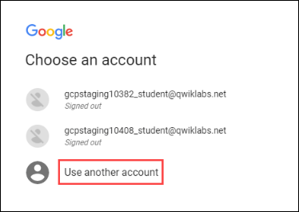
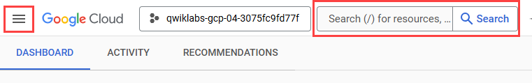
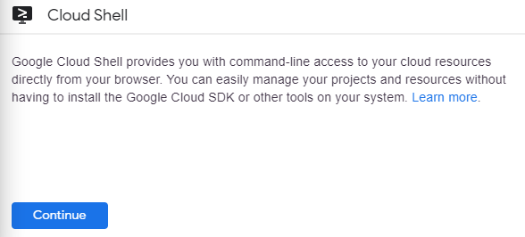
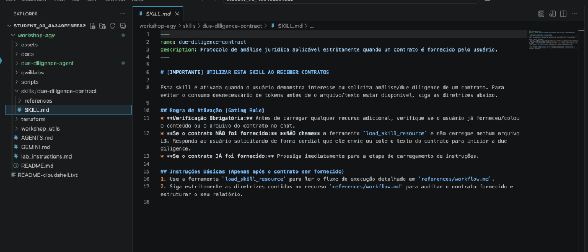
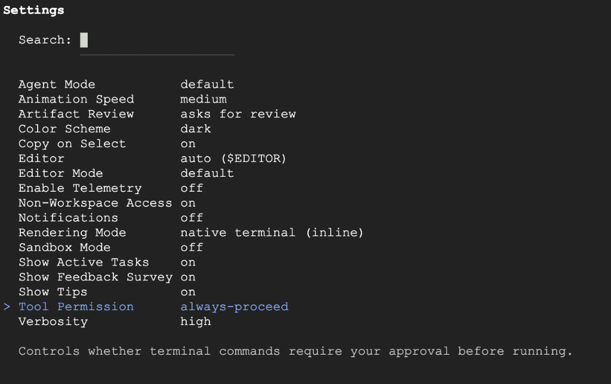
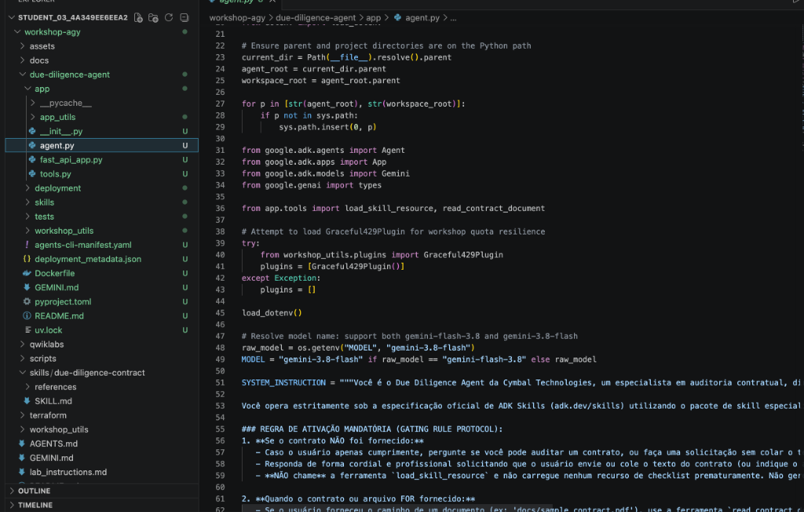
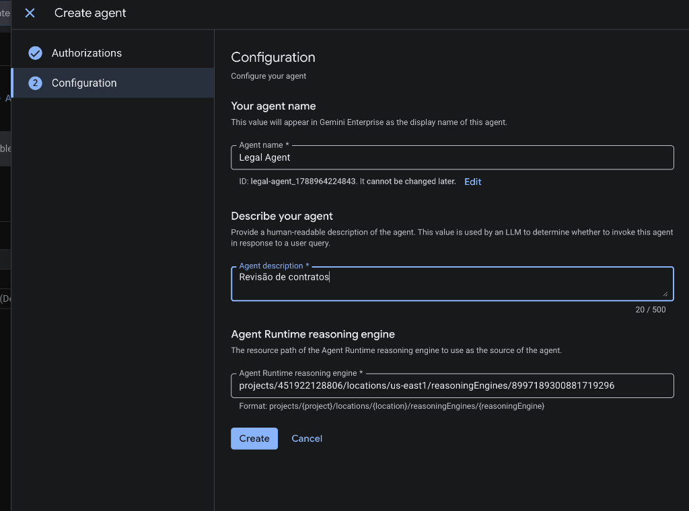
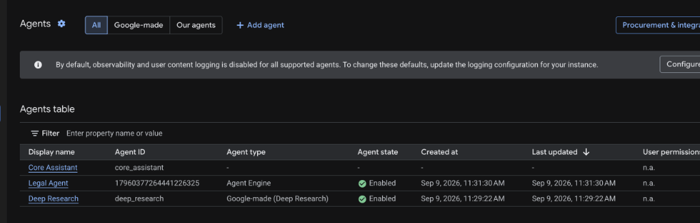
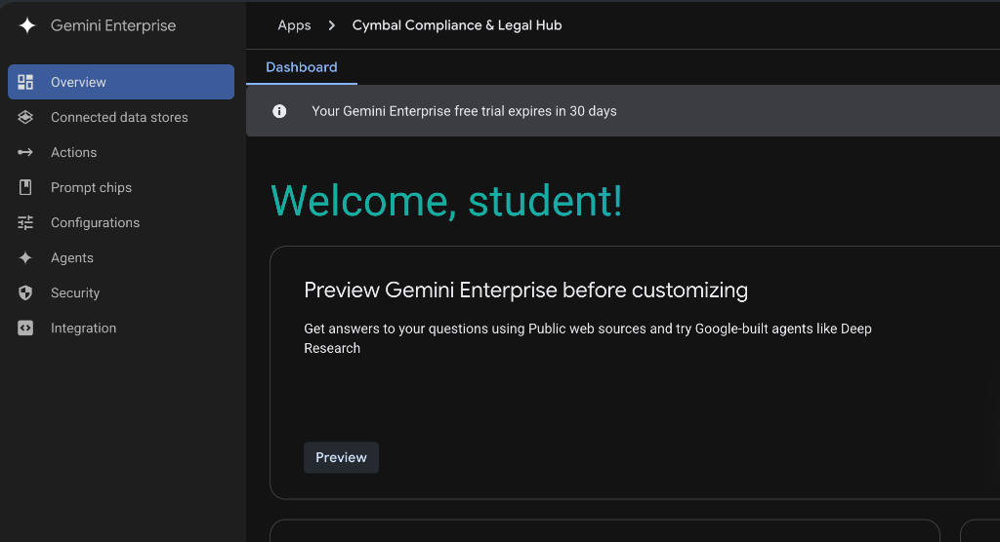
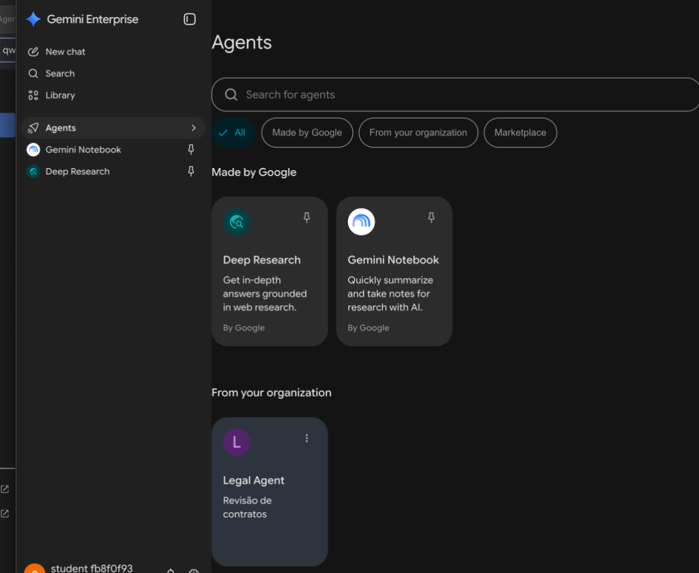

# Implantação de um Agente de Due Diligence com Antigravity CLI e ADK: Laboratório com Desafio

## Informações do Laboratório

- **Tempo estimado:** 1 hora 30 minutos
- **Nível:** `Foundational` / `Intermediate`

---

## Visão Geral

Neste laboratório prático com desafio, você vai demonstrar sua capacidade de usar o **Antigravity CLI (`agy`)** como copiloto de desenvolvimento em terminal para construir um agente inteligente com o **Kit de Desenvolvimento de Agente (ADK)** aproveitando o ecossistema de **Skills** do `agents-cli`.

Você vai integrar uma skill especializada de Due Diligence, testar e refinar o comportamento localmente com a interface **ADK Web**, orquestrar a implantação no **Google Cloud Agent Runtime** diretamente através do assistente `agy` e publicá-lo no **Gemini Enterprise App**.

### Arquitetura da Solução e Fluxo de Componentes

O diagrama a seguir ilustra a jornada de ponta a ponta que você percorrerá neste laboratório, desde o desenvolvimento no Cloud Shell até a disponibilização do agente para os colaboradores corporativos no Gemini Enterprise:


### Modelo Mental: Do Desenvolvimento Tradicional ao Mundo de Agentes

Se você tem experiência com desenvolvimento de software tradicional (APIs REST, frameworks web e scripts), utilize a tabela abaixo como mapa conceitual para conectar os conceitos deste laboratório ao seu conhecimento prévio:

| Conceito no Workshop | Equivalente no Desenvolvimento Tradicional | Papel no Ciclo de Vida do Agente |
| :--- | :--- | :--- |
| **Antigravity CLI (`agy`)** | Copiloto / Par programador no terminal | Seu assistente interativo que gera código, refina regras e orquestra comandos no terminal. |
| **Google ADK** | Framework backend (ex: FastAPI, Express, Flask) | Kit de desenvolvimento em Python que estrutura a lógica, ciclo de vida e estado do agente. |
| **Skills (`SKILL.md`)** | Middlewares de negócio / Manuais de compliance | Pacotes em Markdown com regras e diretrizes que o agente consulta para auditar contratos. |
| **Comando `/grill-me`** | Refinamento de requisitos com Tech Lead | Entrevista socrática que alinha escopo, entradas, saídas e regras de segurança antes de codificar. |
| **ADK Web** | Servidor local com UI (Swagger / Postman) | Interface web local para testar e depurar o agente no navegador antes do deploy na nuvem. |
| **Agent Runtime** | Plataforma Serverless gerenciada (ex: Cloud Run) | Ambiente de nuvem gerenciado que hospeda o contêiner do seu agente com segurança e escala. |
| **Gemini Enterprise App** | Portal corporativo / Frontend da empresa | Ponto de contato final onde os colaboradores da empresa conversam com o agente integrado. |

### Objetivos do Laboratório

Neste laboratório, você aprende a realizar as seguintes tarefas:

- Configurar o ambiente do Cloud Shell e inicializar o assistente **Antigravity CLI (`agy`)**.
- Instalar o `agents-cli` e habilitar a suíte de skills do ADK para uso no `agy`.
- Criar e estruturar um agente ADK de Due Diligence integrado a skills usando o comando interativo `/grill-me` no `agy`.
- Executar, validar e depurar o fluxo do agente localmente com a interface **ADK Web** com assistência do `agy`.
- Fazer a implantação do agente no **Google Cloud Agent Runtime** utilizando o `agy` e as skills do `agents-cli`.
- Publicar e disponibilizar o agente no **Gemini Enterprise App** conectando o resource name do Agent Runtime.

---

## Configuração e Requisitos

### Antes de clicar no botão Iniciar laboratório

Leia atentamente estas instruções. Os laboratórios são cronometrados e não podem ser pausados. O temporizador é iniciado assim que você clica em **Iniciar laboratório** e indica por quanto tempo os recursos do Google Cloud permanecerão disponíveis para você.

Este laboratório prático permite realizar as atividades em um ambiente real de nuvem, e não em uma simulação ou demonstração. Você receberá novas credenciais temporárias para fazer login e acessar o Google Cloud durante a sessão.

Para concluir este laboratório, você precisa de:

- Acesso a um navegador de internet padrão (recomendamos o Google Chrome).
- Tempo suficiente para concluir o roteiro — lembre-se de que não é possível pausar um laboratório em andamento.

> ⚠️ **MUITO IMPORTANTE — Janela Anônima Obrigatória:**  
> Utilize sempre uma **Janela Anônima (Incognito)** ou privada do navegador Google Chrome para executar este laboratório. Isso evita conflitos de autenticação entre sua conta pessoal/corporativa e a conta de estudante temporária, prevenindo cobranças indevidas em sua conta pessoal.

> 🔒 **Uso Exclusivo da Conta de Estudante:**  
> Utilize estritamente as credenciais fornecidas no painel do laboratório. Se você utilizar sua conta pessoal do Google Cloud, cobranças poderão ser geradas diretamente nela.

### Fazer login no Console do Google Cloud

1.  No painel lateral esquerdo do laboratório, clique com o botão direito no botão **Abrir console do Google Cloud** e selecione **Abrir link em janela anônima**.
2.  Se a página exibir a caixa de diálogo **Escolher uma conta** (*Choose an account*), clique em **Usar outra conta** (*Use another account*):  
   
3.  Na tela de login do Google, cole o **Nome de usuário** temporário fornecido pelo painel e clique em **Avançar** (*Next*).
4.  Cole a **Senha** temporária fornecida e clique em **Avançar** (*Next*).
5.  Conclua as telas seguintes da conta temporária:
   - Na tela **Bem-vindo à sua nova conta**, clique em **Entendi** / **Aceitar**;
   - Na tela **Proteja sua conta**, **NÃO** adicione telefone de recuperação ou 2FA — clique em **Atualizar mais tarde** / **Agora não** (*Update later* / *Not now*);
   - Aceite os **Termos de Serviço** do Google Cloud Console clicando em **Concordar e continuar**, sem se inscrever em períodos de teste gratuito.

> 💡 **Dica de Navegação no Console do Google Cloud:**  
> Para acessar os produtos e serviços do Google Cloud, clique no **Menu de navegação** (`☰`) no canto superior esquerdo ou digite o nome do serviço no campo **Pesquisar** (`Search (/)`):  
> 

---

## Cenário do Desafio

A **Cymbal Technologies** é uma empresa líder em soluções corporativas de tecnologia em nuvem e inteligência artificial sediada no Vale do Silício, em franca expansão global. Com uma estratégia agressiva de fusões, aquisições (M&A) e contratação massiva de fornecedores de tecnologia, os times jurídico e de compliance da Cymbal Technologies estão sobrecarregados com o volume de contratos sociais, termos de confidencialidade e instrumentos societários que precisam ser auditados minuciosamente todos os dias.

Para dar escala a essas auditorias mantendo o mais rigoroso padrão de compliance, a liderança de engenharia designou você como Engenheiro de IA da **Cymbal Technologies**. 

**O seu desafio é criar um agente de Due Diligence usando `agents-cli` e ADK para servir no Gemini Enterprise App da Cymbal Technologies através do Agent Runtime.**

Você será responsável por configurar o assistente **Antigravity CLI (`agy`)**, explorar as skills fornecidas pelo `agents-cli`, utilizar técnicas de prompting e refinamento com o comando `/grill-me` para incorporar a skill de auditoria contratual, testar e depurar a solução localmente, orquestrar o deployment no **Agent Runtime** utilizando as skills do `agy` e disponibilizar o agente diretamente no **Gemini Enterprise** para os colaboradores da Cymbal Technologies.

---

## Tarefa 1. Configurar o ambiente e inicializar o Antigravity CLI

Nesta tarefa, você inicializa as variáveis do Cloud Shell, clona os artefatos do workshop, instala as ferramentas CLI (`uv`, `agy` e `agents-cli`) e autentica o assistente de desenvolvimento no seu projeto Google Cloud.

1.  No Console do Google Cloud, clique em **Ativar o Cloud Shell**  e, na janela informativa, clique em **Continuar** (*Continue*):  
   

2.  Inicialize as variáveis de ambiente com o projeto sandbox ativo (quando o primeiro comando `gcloud` exibir o pop-up **"Autorizar o Cloud Shell a fazer chamadas de API do GCP"**, clique obrigatoriamente em **Autorizar** / *Authorize*):

    ```bash
    export PROJECT_ID=$DEVSHELL_PROJECT_ID

    # Obter dinamicamente a região e zona atribuídas ao sandbox pelo Qwiklabs:
    export REGION=$(gcloud compute project-info describe --format="value(commonInstanceMetadata[google-compute-default-region])" 2>/dev/null)
    export REGION=${REGION:-$(gcloud config get-value compute/region 2>/dev/null)}
    export REGION=${REGION:-us-central1}

    export ZONE=$(gcloud compute project-info describe --format="value(commonInstanceMetadata[google-compute-default-zone])" 2>/dev/null)
    export ZONE=${ZONE:-${REGION}-a}

    gcloud config set project $PROJECT_ID
    gcloud config set compute/region $REGION
    gcloud config set compute/zone $ZONE

    cat << EOF >> ~/.bashrc
    export PROJECT_ID=${PROJECT_ID}
    export REGION=${REGION}
    export ZONE=${ZONE}
    export PATH="\$HOME/.local/bin:\$PATH"
    EOF
    ```

3.  Clone o repositório do workshop:

    ```bash
    git clone https://github.com/carlosmscabral/workshop-agy.git ~/workshop-agy
    cd ~/workshop-agy
    ```

4.  Instale o gerenciador de pacotes `uv` e a CLI do Antigravity (`agy`):

    ```bash
    curl -LsSf https://astral.sh/uv/install.sh | sh
    source $HOME/.local/bin/env

    curl -fsSL https://antigravity.google/cli/install.sh | bash
    export PATH="$HOME/.local/bin:$PATH"
    ```

5.  Inicie o setup interativo do **Antigravity CLI**:

    ```bash
    agy
    ```

6.  Siga as 9 etapas de autenticação, configuração e inicialização exibidas no terminal *(dica: use `CTRL+Clique` / `CMD+Clique` para abrir links e `CTRL+SHIFT+V` / `CMD+V` para colar no terminal; não use `CTRL+C` para não interromper o `agy`)*:

- **Passo 1:** Selecione `2. Use a Google Cloud project`  
  

- **Passo 2:** Selecione `1. Continue with Google Cloud`  
  

- **Passo 3:** Conceda as permissões de acesso na Janela Anônima e cole o código de autorização no terminal (`CTRL+SHIFT+V` / `CMD+V`)  
  

- **Passo 4:** Cole (`CTRL+SHIFT+V` / `CMD+V`) o ID do seu projeto sandbox (`echo $PROJECT_ID`)  
  

- **Passo 5:** Em **Select Google Cloud Location**, selecione a opção `global`  
  

- **Passo 6:** Em **Select License**, selecione a opção `1. Agent Platform`  
  

- **Passo 7:** Em **Choose your color scheme**, selecione o tema de cores de preferência (ex: `dark`)  
  

- **Passo 8:** Em **Terms of Service & Data Use**, selecione `Done` para aceitar os termos  
  

- **Passo 9:** Em **Do you trust the contents of this project?**, selecione `Yes, I trust this folder`  
  

### Explorar comandos básicos do agy e a estrutura da Skill

1.  No prompt do `agy >`, execute `/help` para conhecer os atalhos e comandos interativos disponíveis:

    ```text
    /help
    ```

2.  Faça um teste rápido de leitura de contexto enviando o prompt abaixo para que o `agy` inspecione a skill pré-fornecida no repositório:

    ```text
    Leia o arquivo skills/due-diligence-contract/SKILL.md e resuma em 3 tópicos como funciona a regra de Gating deste agente.
    ```

3.  Após conferir a resposta do assistente, saia da sessão interativa digitando `/exit` para retornar ao terminal do Cloud Shell (`$`):

    ```text
    /exit
    ```

4.  Na barra superior do Cloud Shell, clique em **Abrir Editor** (*Open Editor*) , abra `workshop-agy/skills/due-diligence-contract/SKILL.md` para visualizar a estrutura da skill do ADK e, em seguida, clique em **Abrir Terminal** (*Open Terminal*) para voltar ao prompt (`$`):  
   

---

## Tarefa 2. Instalar o agents-cli, habilitar skills e criar o agente

Nesta tarefa, você instala o `agents-cli`, valida obrigatoriamente o catálogo de skills do ADK no assistente `agy`, utiliza o comando `/grill-me` para alinhar e gerar a arquitetura do agente de Due Diligence, configura o ambiente com o modelo `gemini-flash-3.8` na região `global` e inspeciona o código gerado em `app/agent.py`.

1.  No terminal do Cloud Shell, instale e configure o `agents-cli` e atualize o `PATH`:

    ```bash
    uvx google-agents-cli setup
    export PATH="$HOME/.local/bin:$PATH"
    ```

2.  Confirme que as skills foram vinculadas e inicie novamente o assistente `agy`:  
   

    ```bash
    agy
    ```

3.  **Verificar as Skills Instaladas (Obrigatório):** Com o `agy` aberto, execute obrigatoriamente o comando `/skills` para validar que as skills do `agents-cli` foram carregadas:

    ```text
    /skills
    ```

4.  Confirme na lista exibida que as **7 skills** (`google-agents-cli-*`) estão ativas (conforme a imagem abaixo), pressione `ESC` para fechar o menu e execute `/config`:  
   

    ```text
    /config
    ```

5.  No menu do `/config`, selecione **Tool Permission**, altere para **`always-proceed`**, pressione `ESC` para fechar o menu e execute o comando `/grill-me`:  
   

    ```text
    /grill-me
    ```

6.  Durante a entrevista do `/grill-me`, responda às perguntas com foco na auditoria societária:
   - **Objetivo central:** *Auditar contratos sociais e minutas societárias para identificar riscos jurídicos, cláusulas de administração e restrições de quotas.*
   - **Ferramentas e skills:** *Utilizar a especificação formal de ADK Skills ([adk.dev/skills](https://adk.dev/skills/)), incorporando o pacote de skill em `skills/due-diligence-contract/SKILL.md` e os templates do `agents-cli`.*
   - **Regra de gating de entrada:** *O agente só deve carregar o checklist detalhado após receber um contrato ou texto jurídico válido do usuário.*
   - **Formato de saída esperado:** *Relatório estruturado em Markdown com classificação de risco (Alto/Médio/Baixo) e recomendações práticas.*

7.  Solicite ao `agy` para criar a estrutura do agente utilizando a especificação de ADK Skills ([adk.dev/skills](https://adk.dev/skills/)):

    ```text
    Crie um projeto de agente ADK chamado due-diligence-agent seguindo a especificação oficial de ADK Skills (adk.dev/skills) e as convenções do agents-cli. O agente deve carregar a skill especializada localizada em ../skills/due-diligence-contract/SKILL.md, respeitar estritamente a regra de gating (não carregar instruções detalhadas antes que um contrato seja enviado) e consultar references/workflow.md para estruturar o relatório de auditoria.
    ```

8.  Saia do `agy` digitando `/exit`, acesse o diretório do agente recém-criado e configure o arquivo `.env` diretamente no seu local definitivo:

    ```bash
    cd ~/workshop-agy/due-diligence-agent

    cat << EOF > .env
    GOOGLE_GENAI_USE_VERTEXAI=TRUE
    GOOGLE_CLOUD_PROJECT=${PROJECT_ID}
    GOOGLE_CLOUD_LOCATION=global
    MODEL=gemini-flash-3.8
    EOF
    ```

9.  Sincronize as dependências do projeto com o `uv`:

    ```bash
    uv sync
    ```

10. Antes de testar o agente, clique em **Abrir Editor** (*Open Editor*)  na barra superior do Cloud Shell, abra `due-diligence-agent/app/agent.py` para inspecionar o código Python gerado pelo `agy` e, em seguida, clique em **Abrir Terminal** (*Open Terminal*) para retornar ao terminal (`$`):  
   

---

## Tarefa 3. Testar e refinar o agente localmente com ADK Web

Nesta tarefa, você valida o comportamento do agente e suas regras de gating através da interface visual do ADK Web, utilizando o `agy` para depurar e refinar qualquer resposta conforme necessário.

1.  Acesse o diretório do agente e inicie a interface Web do ADK liberando as conexões do proxy do Cloud Shell:

    ```bash
    cd ~/workshop-agy/due-diligence-agent
    uv run adk web --allow_origins="*"
    ```

2.  Assim que o terminal exibir **`ADK Web Server started | For local testing, access at http://127.0.0.1:8000.`**, clique diretamente no link **`http://127.0.0.1:8000`** no terminal (`CTRL+Clique` / `CMD+Clique`) para que o Cloud Shell abra automaticamente a interface do ADK Web em uma nova aba *(ou clique em **Visualização na Web**  $\rightarrow$ **Alterar porta** para **`8000`**)*.
3.  Consulte a minuta do contrato de amostra [sample_contract.pdf](https://storage.googleapis.com/workshop-agy-public-assets/sample_contract.pdf) e teste a regra de gating e a auditoria enviando o documento no chat.
4.  Refine prompts com o `agy` caso deseje ajustar o relatório.
5.  Quando concluir a validação, pressione `CTRL+C` no terminal para encerrar o servidor do ADK Web.

---

## Tarefa 4. Fazer o deploy do agente no Google Cloud Agent Runtime

Nesta tarefa, você utiliza o assistente Antigravity CLI para orquestrar a compilação, containerização e implantação do agente no **Google Cloud Agent Runtime** através das skills integradas do `agents-cli`.

1.  Acesse a pasta do agente, inicie o `agy` e solicite a implantação:

    ```bash
    cd ~/workshop-agy/due-diligence-agent
    agy
    ```

2.  No prompt do `agy`, solicite o deploy:

    ```text
    Faça o deploy do agente due-diligence-agent no Agent Runtime. Use o projeto e a região já configurados neste Cloud Shell, obtendo os valores com "gcloud config get-value project" e "gcloud config get-value compute/region".
    ```

3.  Em uma segunda aba do Cloud Shell (`+`), você pode acompanhar o status da operação de longa duração (LRO) em paralelo *(se o Cloud Shell desconectar por inatividade durante os 3 a 7 minutos, basta clicar em **Reconectar** e rodar este mesmo comando)*:

    ```bash
    cd ~/workshop-agy/due-diligence-agent
    agents-cli deploy --status --project $PROJECT_ID
    ```

4.  Ao término do deploy (3 a 7 minutos), anote o **Resource Name** gerado (`projects/.../locations/.../reasoningEngines/...`).
5.  Valide a prontidão do agente remoto executando uma consulta de teste no `agy` e saia com `/exit`:

    ```text
    Execute um teste rápido contra o agente remoto implantado no Agent Runtime enviando a mensagem "Olá, preciso auditar um contrato social" e confirme se o endpoint remoto responde aplicando a regra de gating.
    ```

---

## Tarefa 5. Conectar e publicar o agente no Gemini Enterprise App

Nesta tarefa final, você conecta o recurso do Agent Runtime ao **Gemini Enterprise App** para disponibilizar o assistente de Due Diligence para os colaboradores corporativos da Cymbal Technologies.

> ⚠️ **Dica de Propagação de IAM no Gemini Enterprise:**  
> Ao vincular o agente e clicar em **Create**, caso a interface exiba erro temporário de permissão, aguarde de 30 a 60 segundos e clique novamente em **Create** para que a conta de serviço do Gemini Enterprise conclua a propagação de permissões no Google Cloud IAM.

1.  No Console do Google Cloud, pesquise por **Gemini Enterprise** ou **Agent Builder**.
2.  Habilite o Gemini Enterprise App:  
   

3.  Crie um aplicativo corporativo chamado **Cymbal Compliance & Legal Hub**:  
   

4.  Na aba **Features**, ative a opção **Agentes** (*Agents*).
5.  No menu **Agentes**, clique em **Adicionar Agente** (*Add Agent*):  
   

6.  Selecione o card **Custom agent via Agent Runtime** e clique em **Add**:  
   

7.  Na etapa **1. Authorizations**, clique em **Skip**. Na etapa **2. Configuration**, informe o nome (`Legal Agent`), descrição (`Revisão de contratos`) e o **Resource Name** do Agent Runtime da Tarefa 4, e clique em **Create**:  
   

8.  Confirme que o agente aparece listado na tabela de agentes com o status **Enabled**:  
   

9.  No menu lateral do aplicativo **Cymbal Compliance & Legal Hub**, acesse **Overview** e, no card **Preview Gemini Enterprise before customizing**, clique no botão **Preview**:  
   

10. Na janela ou pop-up de visualização que carregar, clique em **Agents** no menu lateral e selecione o agente criado anteriormente (**Legal Agent**) na seção **From your organization**:  
   

11. No chat aberto do agente corporativo, envie um trecho da minuta de contrato para validar a geração do parecer de conformidade e auditoria de Due Diligence em produção.

---

## Encerrar o Laboratório

1.  Ao concluir todas as atividades, clique no botão vermelho **Terminar o laboratório** (*End Lab*).
2.  Na janela de confirmação, clique em **Enviar** (*Submit*).
3.  Avalie sua experiência com o laboratório selecionando de 1 a 5 estrelas.

---

## Parabéns!

Você concluiu com sucesso o laboratório com desafio de **Implantação de Agente de Due Diligence com Antigravity CLI e ADK**!

**Manual Last Updated: September 1, 2026**  
**Lab Last Tested: September 1, 2026**

Copyright 2026 Google LLC. Todos os direitos reservados.
